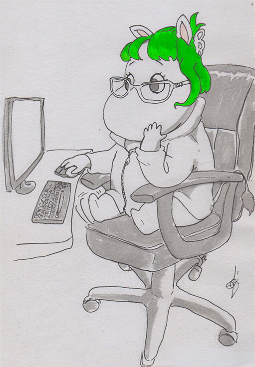
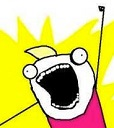

### Hi there, I'm Monica Avila - aka [Godzimona][website] 👋

## I'm UX/UI/Product Designer and I started my path as Front-End in 2020!

- 
 
I'm currently working on a financial management platform app, my role are related with <A HREF="https://bitso.com/"> Product design activities </A>!

- 

&nbsp;&nbsp;&nbsp;&nbsp;&nbsp;I'm currently learning new Universal Methods of Design, Design &nbsp;&nbsp;&nbsp;&nbsp;&nbsp;Systems, and Poduct Psychology.

- 
 
&nbsp;&nbsp;&nbsp;&nbsp;&nbsp;Fun fact: I'm a Ravenclaw, I have two dogs them inspire my fictitious &nbsp;&nbsp;&nbsp;&nbsp;&nbsp;users names, I love Pizza and travel.

- 
 
&nbsp;&nbsp;&nbsp;&nbsp;&nbsp;Goal 2024: Start Accessibility certification and create a full Design &nbsp;&nbsp;&nbsp;&nbsp;&nbsp;System.

- 
 
I’m looking to collaborate as Growth Oriented Product Designer.

---

    
    

 

---

## &#x1f4c8; GitHub Stats

    

<!-- links to actual job and portfolio -->

[website]: <https://www.figma.com/proto/IkKXD6lysIOozmXfQXBkId/Monica-(PD)-Portfolio-2023?page-id=0%3A1&type=design&node-id=1-1608&viewport=1086%2C590%2C0.04&t=DQuW8ochPTFbZkUV-1&scaling=min-zoom&starting-point-node-id=1%3A23&mode=design](https://www.figma.com/proto/IkKXD6lysIOozmXfQXBkId/Monica-(PD)-Portfolio-2023?page-id=0%3A1&type=design&node-id=1-23&viewport=1422%2C659%2C0.1&t=szKEUOH7n76Df1Kq-1&scaling=min-zoom&starting-point-node-id=1%3A23&mode=design> "Monicavila Portfolio"

<!-- Resources -->
<!-- Icons: https://simpleicons.org/ -->
<!-- GitHub Stats: https://github.com/anuraghazra/github-readme-stats -->
<!-- Emojis: https://revelry.co/resources/remote-work/custom-slack-emoji/ -->
<!-- Awesome GitHub Profile README: https://github.com/abhisheknaiidu/awesome-github-profile-readme -->
